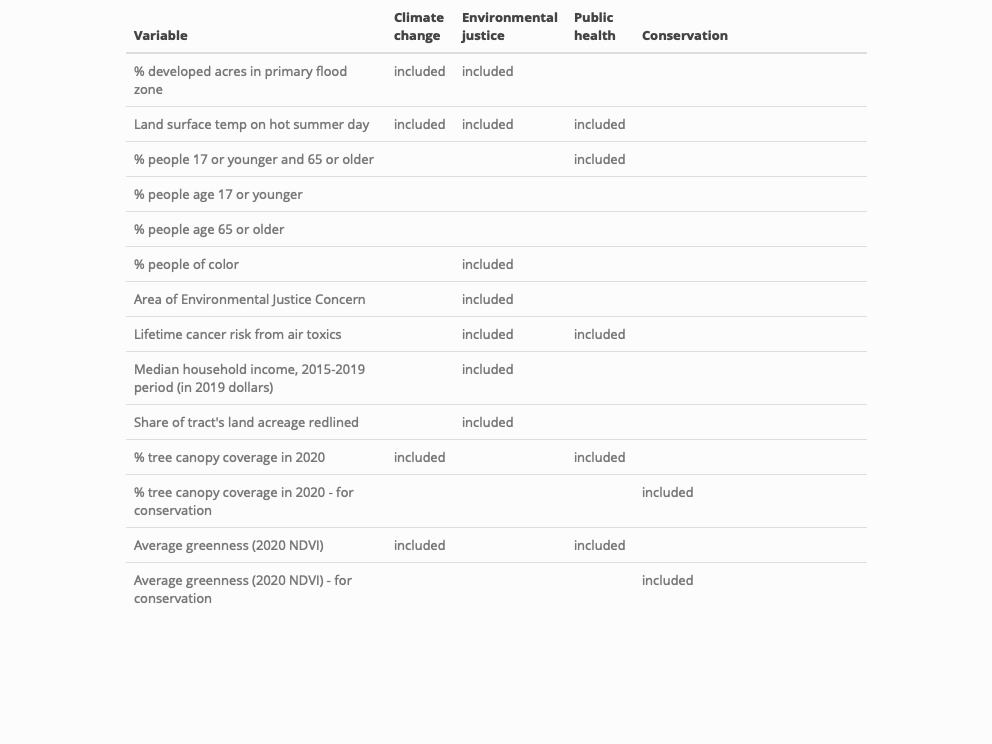

<span align="left">
Presets are developed to provide starting points for various stakeholder groups. Priority scores are calculated using equally-weighted variables.  <br><br>

**Climate change:** Trees can mitigate some consequences of climate change by cooling land surface temperatures and reducing flooding. Use this preset to identify areas most at risk from climate change.<br><br>

**Environmental justice:** The natural and built environments intersect with income, race, and ethnicity. This preset identifies areas and people facing disproportionately negative consequences of environmental decisions.<br><br>

**Public health:** Trees improve air quality and cool land surface temperatures leading to better health outcomes, particularly for sensitive populations. Identify areas where trees could most improve health outcomes.<br><br>

**Conservation:** Above and beyond enhancing the tree canopy, reducing tree canopy loss will be critical to meet carbon emission reduction goals and conserve biodiversity across taxa. This preset identifies areas with the region's highest stock of existing trees. <br><br>

**Custom:** Select this option to customize the prioritization variables.<br><br></span>


```{r message = F, warning=F, echo = F}
library(tidyverse)
library(dplyr)

helperFunction <- function(x){
    ifelse(x=="1", "included", "")
}

load("./data/metadata.rda")
plotthis <- metadata %>%
  select(name, cc, ej, ph, cons) %>%
  rename(Variable = name,
         `Climate change` = cc,
         `Environmental justice` = ej,
         `Public health` = ph,
         Conservation = cons) %>%
   # mutate(across(where(is.numeric), ~na_if(., 0))) %>%
   mutate(across(where(is.numeric), helperFunction))


kableExtra::kbl(plotthis,
               booktabs = T) %>%
  kableExtra::kable_styling(#latex_options = "striped",
                            full_width = F) %>%
  kableExtra::column_spec(1, width = "20em") %>%
  kableExtra::column_spec(2, width = "5em") %>%
  kableExtra::column_spec(3, width = "5em") %>%
  kableExtra::column_spec(4, width = "5em") %>%
  kableExtra::save_kable("inst/app/www/presets.png", zoom = 1.5)
```



