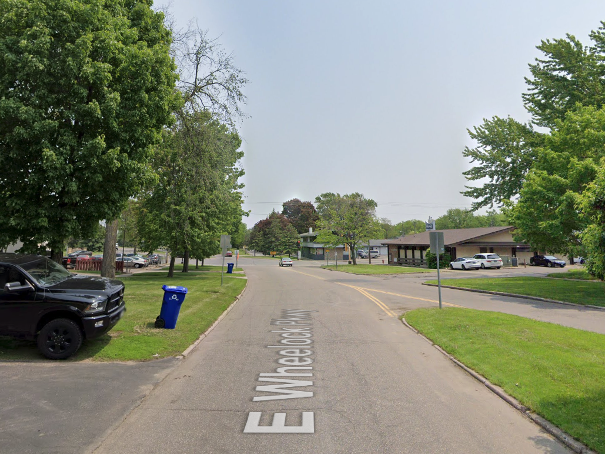

```{css, echo=FALSE, include = F, eval =F}
caption {
    font-size: .9em;
    font-color: #A9A9A9
}
```


```{r assignments, echo=F, message=F, warning=F, results='hide'}
library(dplyr)
library(stringr)
library(ggplot2)
library(tidyr)

knitr::opts_chunk$set(echo = TRUE, fig.align="center", echo = F)

# fancyname <- params$param_area


```


# Report for `r params$param_area`


```{r map, echo = F, message = F, warning = F, fig.alt = "Outline of the Twin Cities region, the area which this report was made for is mapped in green.", fig.align="right", out.width= "43%", out.extra='style="float:right; padding:10px"'}
#, fig.cap = "\\label{fig:map}The geographic location of the selected area. The selected area is highlighed in green."
if(params$param_geo == "blockgroups") {
  region_outline %>% ggplot() + geom_sf(fill = NA, color = "grey80") +
    geom_sf(data = filter(mn_bgs, fancyname == params$param_area), color = councilR::colors$cdGreen, fill = councilR::colors$cdGreen) +
    theme_void()
  } else if (params$param_geo == "ctus") {
     region_outline %>% ggplot() + geom_sf(fill = NA, color = "grey80") +
    geom_sf(data = filter(ctu_list, GEO_NAME == params$param_area), color = councilR::colors$cdGreen, fill = councilR::colors$cdGreen) +
    theme_void()
  } else if (params$param_geo == "nhood") {
     region_outline %>% ggplot() + geom_sf(fill = NA, color = "grey80") +
    geom_sf(data = filter(nhood_list, GEO_NAME == params$param_area), color = councilR::colors$cdGreen, fill = councilR::colors$cdGreen) +
    theme_void()}

# Growing Shade was developed for planners and foresters, but is available to anyone who wants this information.
# 
# Trees provide critical ecosystem services and are important components of the human, natural and built environments. Enhancing and maintaining tree canopy cover is an actionable step to create healthy places for people to live and a resilient future.

# This report synthesizes and summarizes data about trees, people, and the built environments. Understanding the tree canopy within this larger context is important for prioritization and planning efforts. Please review "what's next for Growing Shade" or contact us at SOME EMAIL HERE if this report does not address your data needs - we welcome the feedback and may be able to accommodate requests.

```


This report was generated from the Growing Shade interactive resource produced by the Metropolitan Council in collaboration with The Nature Conservancy and Tree Trust. 

Trees help communities thrive. Community-wide benefits from trees include cooler temperatures, improved air quality, cleaner stormwater, improved mental health, and enhanced biodiversity. Enhancing tree canopy cover is an actionable step to create healthy and resilient places. The Growing Shade Project provides data and resources to inform tree planting and canopy preservation for the Twin Cities region.

Trees connect to regional issues and priorities. Public health, environmental justice, climate change, and natural resource conservation all intersect with the tree canopy. Tree planting efforts and ongoing maintenance will benefit from new perspectives, rigorous science, and thoughtful synthesis. Growing Shade was developed for planners and foresters but is available to anyone who wants this information. Stakeholder engagement remains essential to understand community-specific concerns and opportunities for enhancing, preserving, and maintaining the tree canopy.


## Tree canopy

`r params$param_equitypara`

Note that native tallgrass prairie occurs throughout our region - lower tree coverage in areas dominated by tallgrass prairie should not be penalized.

```{r treeplot, fig.align="center", out.width= "70%", fig.asp = .4, fig.alt = "Figure showing the distribution of tree canopy across the region and within the selected geography."}
params$param_treeplot
# Census block groups have different areas and may overlap with other geographies, thus the existing tree canopy cover in the selected area may not be the mean of the block group canopy covers.

```

```{r include = F, eval = F}
### Methodology note

# The method used to detect tree canopy varies across tools. The 30% goal of canopy coverage and values about current canopy coverage in Growing Shade may not align with goals or values presented in other tools. In Growing Shade, we prioritize using current data. Current data is particularly important as our region continues to feel the impact of emerald ash borer on the tree canopy. 
# 
# To get current (near real-time) data, Growing Shade leverages metrics of greenness (normalized difference vegetation index, NDVI) and seasonal patterns in plant growth (phenology) to detect trees from Sentinel-2 satellite data. Sentinel collects data approximately every 10 days, and our method does not need to rely on older data (for instance, LiDAR data for our region is from 2011 and out-of-date). While Sentinel's temporal resolution is excellent, the satellite data has a spatial resolution of 10 meters squared. This is often a bigger area than tree canopies. 
# 
# When comparing tree canopy coverage from Sentinel with a more spatially accurate (but less temporally accurate) 1 meter squared landcover data set, we found that Sentinel tree cover has high correlation with 1 meter landcover, but Sentinel detects about twice as much tree canopy. Essentially, this means that we are detecting areas with at least 50% tree canopy coverage. We re-scaled our data using this relationship to improve the clarity of messaging. Thus, another way to view the goal of 30% canopy cover is to have 60% of land area covered by at least 50% tree canopy. 
```


## Prioritization

`r params$param_ranktext`

Values for all potential variables can be obtained by downloading the raw data from the "mapping tool" tab.

```{r priorityplot, fig.align="center", out.width= "80%", fig.asp = .5, fig.alt = "Figure showing the priority ranking (climate change, conservation, environmental justice, public health) for all block groups within the selected geography."}
params$param_rankplot
```

<br>

```{r priority-table, results='markup', tidy = F}
knitr::kable(params$param_prioritytable,
             booktabs = TRUE) %>%
             # caption = "Average values for the selected area as compared to the region-wide average. Variables shown are those used in prioritization layer. Values for all potential variables can be obtained by downloading the raw data from the Growing Shade Mapping Tool.") %>%
  # kableExtra::kable_styling(full_width = F) %>%
    kableExtra::kable_classic("striped", full_width = F, html_font = "Cambria")# %>%
  # kableExtra::footnote(general = "Average values for the selected area as compared to the region-wide average. Variables shown are those used in prioritization layer. Values for all potential variables can be obtained by downloading the raw data from the Growing Shade Mapping Tool.",
           # general_title = "")
```

## Race & income disparities

`r params$param_equitytext`

```{r include = T, eval = F}
# Research shows that trees are unevenly distributed across communities. In particular, areas with a high percent of the population identifying as a person of color or low-income populations have less tree canopy (<a href = "https://journals.plos.org/plosone/article?id=10.1371/journal.pone.0249715" target="_blank">MacDonald 2021</a>) as do historically redlined areas (<a href = "https://www.npr.org/2020/01/14/795961381/racist-housing-practices-from-the-1930s-linked-to-hotter-neighborhoods-today" target = "_blank">NPR 2020</a>, <a href = "https://www.nature.com/articles/s42949-021-00022-0" target = "_blank">Locke et al. 2021</a>, <a href = "https://www.sciencedirect.com/science/article/abs/pii/S0277953619307531?via%3Dihub" target = "_blank">Namin et al. 2020</a>). Addressing inequity in tree canopy cover may reduce heat-related deaths by up to 25% (<a href = "https://www.fs.fed.us/nrs/pubs/jrnl/2021/nrs_2021_paramita_001.pdf" target = "_blank">Sinha 2021</a>). 

# (358 / 2)/(.12*620961) * 100
# Results indicate that approximately 251 deaths (95% confidence interval of 143 to 358) can be avoided in the city of Baltimore (total population of 620,961) with a 10% increase in tree cover. We also find that more than half of the reduced mortality impacts are for the population over the age of 65 (which is about 12% of the total population)
```

```{r equityplot, fig.align="center", out.width= "70%", fig.asp = .9, fig.alt = "Figure showing the trends between tree canopy and median household income and the percent of population identifying as a person of color."}
params$param_equityplot
```

## Temperature

`r params$para_heattext`

<center>
`){width=70%}
</center>

```{r tempplot, fig.align="center", out.width= "70%", fig.asp = .5}

# NDVI .77 =minnehaha/hidden falls park;  https://www.google.com/maps/@44.9083306,-93.194874,3a,90y,314.57h,93.43t/data=!3m8!1e1!3m6!1sAF1QipNbybtAen_ewnzAt-wDAfVWJJ7MV95h2HJfv-rF!2e10!3e11!6shttps:%2F%2Flh5.googleusercontent.com%2Fp%2FAF1QipNbybtAen_ewnzAt-wDAfVWJJ7MV95h2HJfv-rF%3Dw203-h100-k-no-pi-0-ya138.57913-ro-0-fo100!7i8704!8i4352

# NDVI = .67; summit ave w/ prior; https://www.google.com/maps/@44.9413624,-93.1831969,3a,75y,66.54h,99.45t/data=!3m10!1e1!3m8!1sJNm6kjokIM8RTR-mVuFp9A!2e0!6shttps:%2F%2Fstreetviewpixels-pa.googleapis.com%2Fv1%2Fthumbnail%3Fpanoid%3DJNm6kjokIM8RTR-mVuFp9A%26cb_client%3Dmaps_sv.tactile.gps%26w%3D203%26h%3D100%26yaw%3D50.330505%26pitch%3D0%26thumbfov%3D100!7i16384!8i8192!9m2!1b1!2i21

#NDVI = .42; wheelock entering phalen park: https://www.google.com/maps/@44.984721,-93.0666344,3a,90y,73.59h,101.6t/data=!3m9!1e1!3m7!1sfM_KmqUJNW7P8A_x0LHCUw!2e0!7i13312!8i6656!9m2!1b1!2i14

#NDVI = .17; university and lexington lightrail stop: https://www.google.com/maps/@44.9558413,-93.1471069,3a,75y,258.4h,91.27t/data=!3m9!1e1!3m7!1s0B4cR94lKaxQc_GIJI464Q!2e0!7i16384!8i8192!9m2!1b1!2i14

# labs <- c("<br>Low greenness",
#           "",
#           "")
# 
# bg_growingshade_main %>%
#   filter(variable %in% c("ndvi", "avg_temp")) %>%
#   select(bg_string, variable, raw_value) %>%
#   pivot_wider(names_from = variable, values_from = raw_value) %>%
#   ggplot(aes(x = ndvi, y = avg_temp)) +
#   geom_point() +
#   scale_x_continuous(
#     name = NULL,
#     breaks = c(.17, .42, .67),
#     labels = labs,
#     position = "bottom") +
#   theme(axis.text.x.bottom = ggtext::element_markdown(size = 15))+
#   labs(x = "TEST")

# remotes::install_github("wilkelab/ggtext")

```


```{r old_threats, include = F, eval = F}
### Methodology note

# The normalized difference vegetation index (NDVI) ranges from -1 to 1. Areas with bare ground, or brown vegetation have NDVI values closer to zero. Areas with lots of greenness have values closer to one. The calculation for land surface temperature *does* rely on information about NDVI, so these two variables are not fully independent from each other. Land surface temperature is calculated using other data as well. The NDVI data shown here comes from the Sentinel-2 satellite (resolution of 10 x 10 meters) and is from year 2021. Land surface temperature shown here comes from data collected by the Landsat-8 satellite (resolution of 30 x 30 meters) and is from year 2016.

## Threats

# `r params$param_otherparea`

```

# Other resources

Growing Shade is a unique tool that highlights stories and allows users to create custom reports to inform tree canopy enhancement and preservation for the Twin Cities region. 

There are additional tools and resources that may be useful for this work.  Please consider the list below as a starting point. Additionally, when planning and prioritizing urban forestry work, tools and data cannot substitute for stakeholder engagement to understand community-specific concerns or opportunities. The on-the-ground knowledge of residents and the expertise of local practitioners are valuable sources of information.


**Tools**<br>
*What additional tools and assessments exist to help prioritize where to plant trees and maintain tree canopy?*<br>
&nbsp; &nbsp; &bullet; <a href = "https://www.itreetools.org/tools/which-tool-should-i-use" target = "_blank">iTree tools</a> to quantify the benefits and values of trees, including tools for individuals such as homeowners concerned with individual or small amounts of trees<br>
&nbsp; &nbsp; &bull; <a href = "https://www.americanforests.org/our-work/tree-equity-score/" target = "_blank">American Forests Tree Equity Score project</a> <br>
&nbsp; &nbsp; &bull; <a href = "https://gis-hennepin.opendata.arcgis.com/pages/tree-planting" target = "_blank">Hennepin County, MN Tree Canopy Tree Planting Priority Areas</a><br>
&nbsp; &nbsp; &bull; <a href = "https://www.stpaul.gov/departments/parks-recreation/natural-resources/forestry/urban-tree-canopy-assessment" target = "_blank">City of Saint Paul Urban Tree Canopy Assessment 2011</a><br>
*Where can I lean more about the benefits provided by urban forests and learn how to build them?*<br>
&nbsp; &nbsp; &bull; <a href = "https://www.vibrantcitieslab.com/" target = "_blank">Vibrant Cities Lab</a><br>
*Where can I learn more about the impact of emerald ash borer?*<br>
&nbsp; &nbsp; &bull; <a href = "https://mnag.maps.arcgis.com/apps/webappviewer/index.html?id=63ebb977e2924d27b9ef0787ecedf6e9" target = "_blank">Minnesota Department of Agriculture's Emerald Ash Borer Map</a>
   
**Community Engagement**<br>
*Why is community engagement essential? What are the impacts of tree planting on communities?*<br>
&nbsp; &nbsp; &bull; <a href = "https://create.umn.edu/toolkit/" target = "_blank">The CREATE Initiative: Sharing in the Benefits of a Greening City</a><br>
*What does genuine community engagement look like?*<br>
&nbsp; &nbsp; &bull; <a href = "https://www.health.state.mn.us/communities/practice/resources/phqitoolbox/docs/AuthenticPrinciplesCommEng.pdf" target = "_blank">Principles of Authentic Communication (MN Dept of Health)</a><br>
&nbsp; &nbsp; &bull; <a href = "https://wholecommunities.org/whole-measures/" target = "_blank">Center for Whole Communities: Whole Measures</a><br>

**Planting Trees and Native Vegetation**<br>
*What trees are predicted to do well in future climate conditions?*<br>
&nbsp; &nbsp; &bull; <a href = "https://forestadaptation.org/sites/default/files/2021-03/TwinCitiesMN_TreeSpeciesVulnerability.pdf" target = "_blank">Climate Change Vulnerability of Urban Trees: Twin Cities, Minnesota</a><br>
*What the best way to plant a tree?*<br>
&nbsp; &nbsp; &bull; <a href = "https://www.youtube.com/watch?v=yQ0Xo7cfMqs" target = "_blank">Tree Trust video</a><br>
*Where can I learn about native plants (trees, grasses, wildflowers): the benefits, purchasing and planting?*<br>
&nbsp; &nbsp; &bull; <a href = "https://mnnps.org/links/" target = "_blank">Minnesota Native Plant Society</a><br>
&nbsp; &nbsp; &bull; <a href = "https://extension.umn.edu/find-plants/native-plants" target = "_blank">University of Minnesota Extension</a><br>

**Climate Change** <br>
*Where can I find more information about climate change impacts in the Twin Cities?*<br>
&nbsp; &nbsp; &bull; <a href = "https://www.fs.usda.gov/sites/default/files/fs_media/fs_document/urbannatureforhumanhealthandwellbeing_508_01_30_18.pdf%22 %EF%BF%BDHYPERLINK %22https://metrocouncil.org/Communities/Planning/Local-Planning-Assistance/CVA.aspx" target = "_blank">Climate Vulnerability Assessment by Metropolitan Council for the Twin Cities</a><br>
&nbsp; &nbsp; &bull; <a href = "https://metrocouncil.maps.arcgis.com/apps/webappviewer/index.html?id=fd0956de60c547ea9dea736f35b3b57e"
            target = "_blank">Extreme Heat Map Tool </a> by Metropolitan Council<br>
&nbsp; &nbsp; &bull; <a href = "https://metrocouncil.maps.arcgis.com/apps/MapJournal/index.html?appid=7d9cdd3929e9439bb5b25aa1186d5783"
            target = "_blank">Extreme Heat Story Map </a> by Metropolitan Council<br>

**Human Health**<br>
*Where can I learn about the impacts of tree on human health?*<br>
&nbsp; &nbsp; &bull; <a href = "https://www.fs.usda.gov/sites/default/files/fs_media/fs_document/urbannatureforhumanhealthandwellbeing_508_01_30_18.pdf" target = "_blank">US Forest Service Report: Urban Nature for Human Health and Well-being 2018</a><br>


**Connect and Learn**<br>
*Where can I connect with others working to grow our tree canopy in the Twin Cities or across Minnesota?*<br>
&nbsp; &nbsp; &bull; <a href = "https://www.mnstac.org/" target = "_blank">Minnesota Shade Tree Advisory Committee</a><br>
&nbsp; &nbsp; &bull; <a href = "https://trees.umn.edu/minnesota-shade-tree-short-course" target = "_blank">Minnesota Shade Tree Short Course</a><br>
&nbsp; &nbsp; &bull; <a href = "https://www.nrs.fs.fed.us/stew-map/" target = "_blank">Stewardship Mapping and Assessment Project (STEW-MAP)</a>: a research tool, community organizing approach, and partnership mapping platform to engage and connect stewards of the local environment<br>
*How can my city receive recognition or a certification for our urban forestry work?*<br>
&nbsp; &nbsp; &bull; <a href = "https://www.arborday.org/programs/treeCityUSA/index.cfm" target = "_blank">Tree City USA</a><br>
&nbsp; &nbsp; &bull; <a href = "https://greenstep.pca.state.mn.us/bp-detail/81726" target = "_blank">GreenStep Cities program</a><br>

**What’s Next** <br>
*What new projects are underway that could support and inform urban forests in the Twin Cities?*<br>
&nbsp; &nbsp; &bull; <a href = "https://mspurbanlter.umn.edu/overview" target = "_blank">Urban LTER (Long-term Ecological Research) in the Twin Cities</a>
        
    

# Methods


Growing Shade developed out of a collaboration between the <a href="https://metrocouncil.org/" target="_blank">Metropolitan Council</a>, <a href="https://www.nature.org/en-us/about-us/where-we-work/united-states/minnesota/" target="_blank">The Nature Conservancy</a>, and <a href="https://treetrust.org/" target="_blank">Tree Trust</a>. We thank members of the advisory group for initial consultations and thank all individuals who provided feedback during the development phase of this project. 

Methods and data sources for the analyses presented within the Growing Shade are detailed below. Please <a href = "mailto:ellen.esch@metc.state.mn.us?subject=growing%shade%20tool&cc=eric.wojchik@metc.state.mn.us">contact us</a> if you have questions or feedback. 


<h2><span style='font-size:16pt'>Prioritization layer</span></h2>

Priority variables were sourced from several locations including:

- Demographic and socioeconomic information comes from the <a href = 'https://gisdata.mn.gov/dataset/us-mn-state-metc-society-census-acs' target = '_blank'>American Community Survey 5-Year Summary File</a> published by the Metropolitan Council. Census block group data is used. 
- Health information comes from the <a href="https://www.cdc.gov/places/index.html" target="_blank">PLACES dataset</a> published by the Center of Disease Control and Prevention. PLACES data is reported by census tract.
- Tree canopy and green space information is obtained from the <a href = 'https://www.esa.int/Applications/Observing_the_Earth/Copernicus/Sentinel-2' target = "_blank">Copernicus Sentinel-2 satellite mission</a>.
- Climate data including temperatures and flood risk was processed using the <a href = 'https://metrocouncil.org/Communities/Planning/Local-Planning-Assistance/CVA.aspx' target = '_blank'>Climate Vulnerability Assessment</a> published by the Metropolitan Council.

<br>
Priority variables were standardized and scaled so that the z-score was normally distributed on a 0-10 scale (by multiplying the normal distribution of the z-score for each variable by 10). 

Based on user-defined selection of priority variables, standardized scores are averaged to create a single, integrated priority value. 


<h2><span style='font-size:16pt'>Tree canopy</span></h2>

Growing Shade uses and shows a tree canopy layer from 2021 A machine learning method was created in <a href = 'https://earthengine.google.com/' target = "_blank">Google Earth Engine</a> and used to detect tree cover from other land cover types using <a href = 'https://www.esa.int/Applications/Observing_the_Earth/Copernicus/Sentinel-2' target = "_blank">Sentinel-2 satellite imagery</a>. Any areas identified as <a href = 'https://gisdata.mn.gov/dataset/us-mn-state-metc-water-lakes-rivers' target = "_blank">open water</a> or <a href = 'https://developers.google.com/earth-engine/datasets/catalog/USDA_NASS_CDL?hl=en' target = '_blank'>cultivated cropland</a> were removed. 

Next, the tree canopy as identified with Sentinel-2 data was calibrated to the tree canopy identified in 2015 using LiDAR data from 2011 (<a href="https://gisdata.mn.gov/dataset/base-landcover-twincities" target="_blank">Twin Cities Metropolitan area 1-meter land cover classification</a>). With 1000 equal-area regions across the 7-county area, a scaling factor of 0.885 was used to bring the Sentinel data in line with on-the-ground tree canopy. This scaling factor is appropriate for our methods of using 10 m x 10 m resolution data, which is often larger than tree canopies. This scaling factor makes our data align very closely with other reports while still leveraging the scalability and temporal accuracy of our method. 

<br><br>


